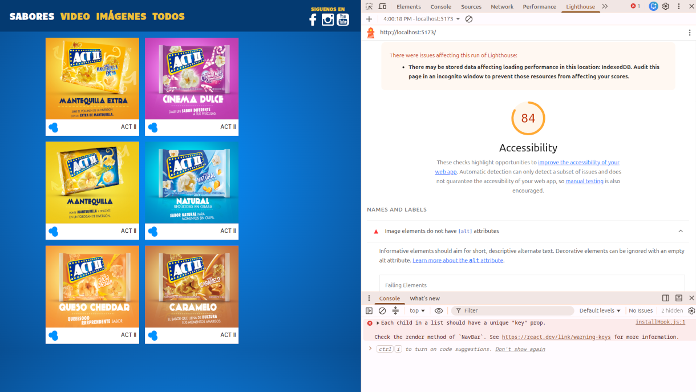
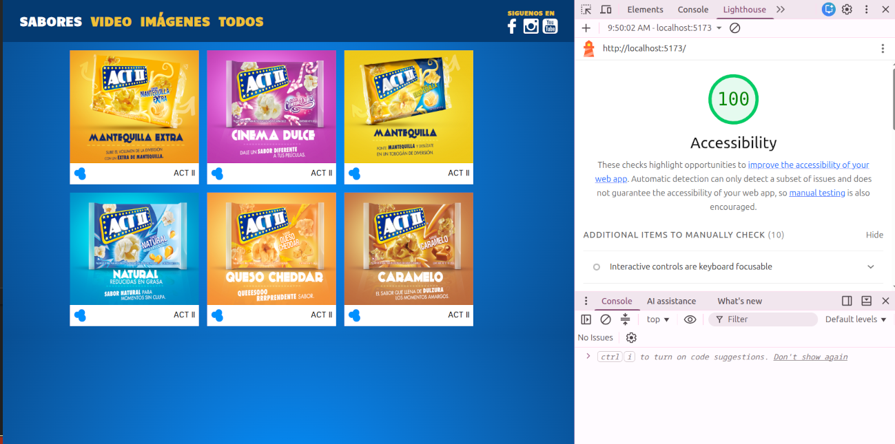

# ACT II


## Getting started

This POC was developed in 2018. To run it with Polymer and Bower, some prerequisites are required.

To run the legacy code, execute the following commands:

```sh
nvm install 8.17.0
npx bower install
polymer serve --open
```

If `polymer serve` returns an error, install it globally:

```sh
npm install -g polymer-cli
```

The legacy version of the ACT II POC is now available in the browser.

## Challenges

The main challenge was running the original POC. Since Polymer is deprecated
and depends on Bower, it requires Node 8.17.0 to work correctly. Modern Node
versions break the dependency resolution, which is why the legacy setup requires
`nvm` to switch versions before installing dependencies.

## Migration planning

| Category        | Choice      |
| --------------- | ----------- |
| Library         | React v19   |
| Typing          | Typescript  |
| Build Tool      | Vite        |
| Package Manager | pnpm        |
| Styling         | TailwindCSS |

## Migration notes

The original POC used Polymer's two-way data binding and native web components.
The migration to React introduced a unidirectional data flow model, which
required a different approach to component communication and state management.

Given the simplicity of the original POC, no complex logic was preserved —
components were rewritten from scratch following React conventions.

## Next steps

- [ ] Accessibility audit and improvements (WCAG 2.1 AA)

### Accessibility lighthouse report improvements



- [x] Image elements do not have [alt] attributes

  All `` elements in the React components now include an `alt` attribute. This lets screen readers describe each image to users who cannot see it.

- [x] Lists do not contain only `<li>` elements and script supporting elements (`<script>` and `<template>`).

  The social media list in [nav-bar.tsx](src/components/nav-bar.tsx) is a `<ul>` that only contains `<li>` items, each wrapping a `<Link>` and an ``. No other element type is placed as a direct child of the list, so the list structure is valid for assistive technology.

- [x] Document does not have a main landmark.

  The React app is now mounted inside a `<main role="main">` element in [index.html](index.html), instead of rendering directly into a plain `<div>`. This gives screen readers a clear landmark to identify the primary content of the page.

- [x] The page contains a heading, skip link, or landmark region

  The page now defines landmark regions: `<nav role="navigation">` in [nav-bar.tsx](src/components/nav-bar.tsx) and `<main role="main">` in [App.tsx](src/App.tsx).

### Accessibility others improvements

- [x] [Reflow](https://www.w3.org/WAI/WCAG21/Understanding/reflow) Avoid double scrolling. Content can be enlarged without increasing line length.


